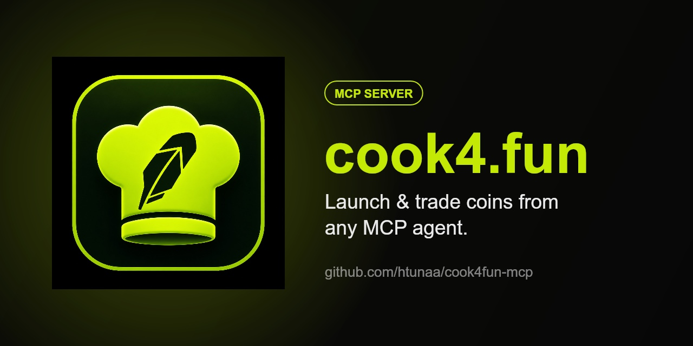

# cook4fun-mcp

An [MCP](https://modelcontextprotocol.io) server that lets any MCP-compatible agent **launch and trade coins on [cook4.fun](https://cook4.fun)**, a Uniswap-V4-native launchpad on the Robinhood chain (chainId `4663`).

It runs **locally** on your own machine (stdio transport), signs with your own wallet, and talks straight to the chain. There is no hosted service and nothing to pay for: your client (Claude Desktop, Cursor, Cline, Windsurf, and other MCP clients) starts it on demand.

## Tools

| Tool | What it does | Wallet needed |
|---|---|---|
| `cook4fun_list_coins` | List the newest coins with market caps | no |
| `cook4fun_wallet` | Show the trading wallet address and ETH balance | yes |
| `cook4fun_launch` | Launch a new coin (deploys token + opens its V4 pool, optional first buy) | yes |
| `cook4fun_buy` | Buy a coin with ETH (slippage-protected) | yes |
| `cook4fun_sell` | Sell a coin back to ETH by amount, percentage, or all (auto-approves) | yes |
| `cook4fun_claim` | Claim reward-sharing fees | yes |

Coins are referenced by contract address (`0x…`) or `$TICKER`.

## Setup

Add the server to your MCP client's config. No install step is required: `npx` fetches and builds it on first run.

**Claude Desktop** (`claude_desktop_config.json`), **Cursor**, **Cline**, **Windsurf**, and most clients use the same shape:

```json
{
  "mcpServers": {
    "cook4fun": {
      "command": "npx",
      "args": ["-y", "github:htunaa/cook4fun-mcp"],
      "env": {
        "COOK4FUN_PRIVATE_KEY": "0xYOUR_WALLET_PRIVATE_KEY"
      }
    }
  }
}
```

Restart the client and the `cook4fun_*` tools appear.

### Configuration

| Env var | Required | Default | Notes |
|---|---|---|---|
| `COOK4FUN_PRIVATE_KEY` | for trading | none | Wallet private key (`0x…`, 32 bytes). Needs ETH on chain 4663 for launch fee, gas, and buys. Read-only tools work without it. |
| `COOK4FUN_RPC_URL` | no | `https://rpc.mainnet.chain.robinhood.com` | Custom RPC endpoint. |
| `COOK4FUN_LAUNCHPAD_ADDRESS` | no | `0xc12F…A352` (live V2) | Override the launchpad contract. |
| `COOK4FUN_SLIPPAGE_BPS` | no | `1000` (10%) | Default slippage tolerance for buys/sells, in basis points. |

> ⚠️ Security: the server can spend everything in this wallet. Fund it with only what you want the agent to trade, and treat the key like any other secret. The key stays on your machine; it is never sent anywhere except to sign transactions locally.

## Example prompts

```
what's new on cook4fun?
launch a coin called "Space Cat" with ticker SCAT
buy 0.05 ETH of $SCAT
sell 50% of my $SCAT
claim my rewards on $SCAT
```

## Run from a local checkout

```bash
git clone https://github.com/htunaa/cook4fun-mcp
cd cook4fun-mcp
npm install
npm run build
```

Then point the client's `command`/`args` at `node` + the built file:

```json
{
  "mcpServers": {
    "cook4fun": {
      "command": "node",
      "args": ["/absolute/path/to/cook4fun-mcp/dist/index.js"],
      "env": { "COOK4FUN_PRIVATE_KEY": "0x…" }
    }
  }
}
```

## Develop

```bash
npm run typecheck
npm run build
```

## License

MIT
